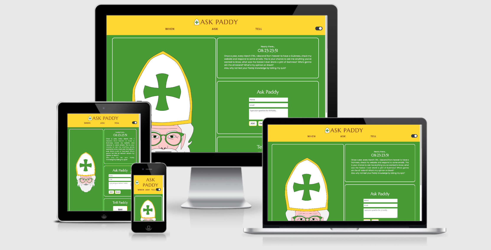
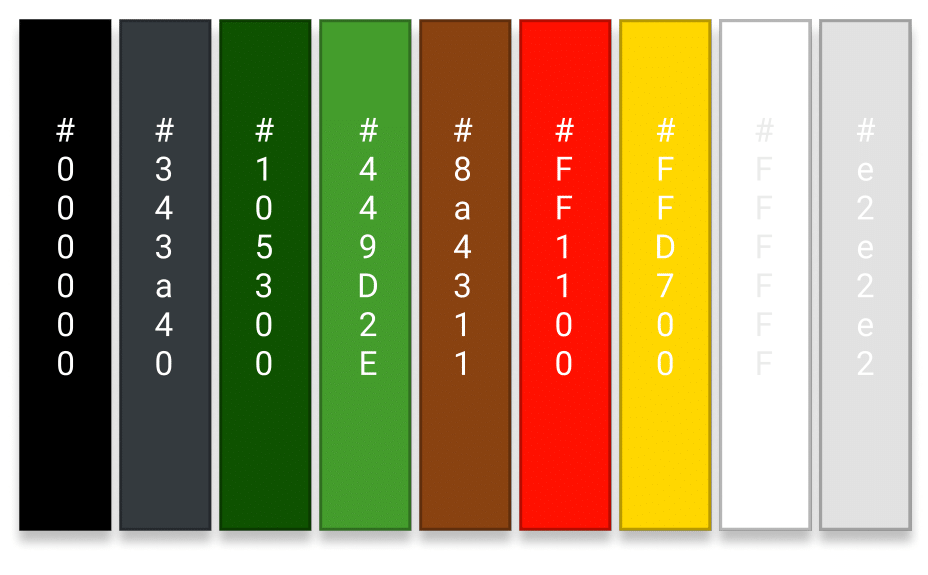

# Ask Paddy 

### [Live Site](https://sean-mc-mahon.github.io/ask_paddy/)

### [GitHub](https://github.com/Sean-Mc-Mahon/ask-paddy)

Ask Paddy is Team 17's entry for the [Code Institute](https://codeinstitute.net/) March hackathon. The idea is that users can ask St. Patrick any question they want, an *almost* direct link to God.

---
## Table of Contents

**

Project overview
**
* [**_Project overview_**](#project-overview)
* [**_User Stories_**](#user-stories)

**

UX
**
    * [_Color Scheme_](#color-scheme)
    * [_Typography_](#typography)
    * [_Media_](#Media)
    * [_Wireframes_](#wireframes)

**

Features
**
* [**_Existing Features_**](#existing-features)
* [**_Features Left to Implement_**](#features-left-to-implement)

**

Technologies Used
**
* [**_Libraries_**](#libraries)
* [**_Version Control_**](#version-control)

**

Accessibility
**

**

Testing
**
* [**_Testing_**](#testing)

**

Deployment
**
* [**Deployment**](#deployment)

**

Credits
**
* [**_Content_**](#content)
* [**_Acknowledgements_**](#acknowledgements)

---

# Project Overview

---

### User Stories

- User Story A: As a User, I wanted to how long it was for it to be Saint Patrick's Day again so I visited Ask Paddy App to check their Saint Patrick's Day Countdow.  
- User Story B: As a User, I was curious to know what Saint Patrick would answer to my question, so I submitted my question on Ask Paddy App.  
- User Story C: As a User, I wanted to play a quiz of about Saint Patrick's Day, so I visited Ask Paddy App.  

## Opportunities arising from user stories:

 
|Opportunities | Importance | Viability / Feasibility
|-----|:------:|:-----:|
|**Simple Clean UI** | 5 | 5 |
|**Clearly indicate purpose** | 5 | 5 |
|**Clear Simple Instructions** | 5 | 5 |

---

#### Design

A standard layout that is fully responsive on mobile devices and larger screens.

#### Color Scheme

#### Typography

We choose [Marcellus](https://fonts.google.com/specimen/Marcellus?preview.text_type=custom#standard-styles) because it has a Celtic feel  
and [Poppins](https://fonts.google.com/specimen/Poppins?preview.text_type=custom) for the body because it is very easy to read.

##### back to [top](#table-of-contents)

---

# Features

## Existing Features

#### Navbar
- The navigation bar features links to our Countdown, Ask a Question and Quiz Sections. 

#### Body
- The body features an Interactive image of Saint Patrick.
- A Countdown to Saint Patrick's Day.
- A form to submit your Questions to Saint Patrick.
- A fun Quiz about Saint Patrick.

#### Footer

The footer features:
- Social Media links.
##### back to [top](#table-of-contents)

# Technologies Used

#### 1. Languages

 [HTML 5](https://en.wikipedia.org/wiki/HTML5)

 [CSS 3](https://en.wikipedia.org/wiki/CSS)

 [Java Script](https://en.wikipedia.org/wiki/JavaScript)

#### 2.Integration

 [Bootstrap](https://getbootstrap.com/)

 [Google Fonts](https://fonts.google.com/)

[EMAILJS](https://www.emailjs.com/)

#### 3. Workspace, version control and Repository storage

 [GIT](https://git-scm.com/)

 [GITHUB](https://github.com/) 

# Resources

[Code Institute](https://codeinstitute.net/) Course Content  
Code Institute SLACK Community  
[Youtube](https://www.youtube.com/) - General resource.  
[Am I Responsive](http://ami.responsivedesign.is/) - Responsive website mockup image generator.

---

# Accessibility
  
# Testing
- Tested the Countdown and it works without any problem.  
- The quiz highligts the correct and wrong answer perfectly.  
- Image of Saint Patrick winks when mouse hover.  
- Question submission form is functional.  
- Background color changegs to white when selected.  
---

# Deployment

This project has been deployed on GitHub Pages with the following process:

- Master Repository was created by Sean.  
- All code was written on GitPod, the code was then pushed to GitHub where it is stored in his Repository. 
- Contribuitions were made through Forking and Merging with the Master branch.
---

# Credits

### Content

1. [Quiz](https://youtu.be/riDzcEQbX6k) 
[GitHub in a Team](https://jameschambers.co.uk/git-team-workflow-cheatsheet)  
[Forking and Merging GitHub](https://www.youtube.com/watch?v=HbSjyU2vf6Y&amp;ab_channel=TheNetNinja)  

### Acknowledgements

1.  We would like to thank our Mentor [Jim](https://github.com/JimLynx) for his help on this project.  
2. Thank all of our Team Members for their efforts on building this project. 

---

This project is for educational use only

##### back to [top](#table-of-contents)
